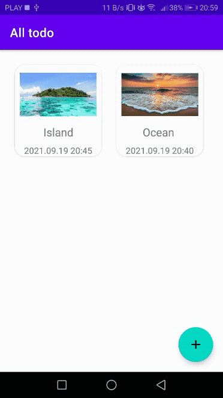
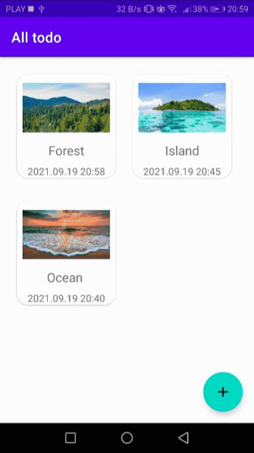
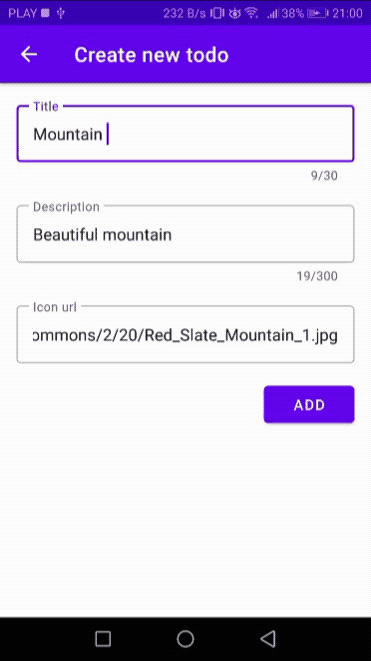
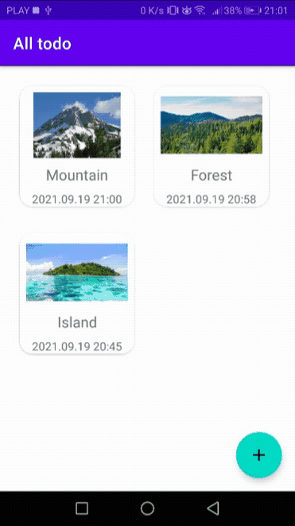

# TodoList
> Aapplication consisting of 2 screens. One of them contain a list of “todo” items and the second one - item creation form.
All data are stored in Firebase Cloud Firestore.

## Table of contents
* [General info](#general-info)
* [Screenshots](#screenshots)
* [Technologies](#technologies)
* [Setup](#setup)
* [Status](#status)

## General info
The main goal of this project was to create application which cooperate with Firebase Cloud Firestore, using Koin dependency injection, and using paggination.

## Screenshots
Real time listener updates 
 
Remove items from list 
 
Create new one items 
 
Update items 
 

## Technologies
* Kotlin - 1.3.70
* Koin Dependency Injection
* Android Studio

## Setup
* Clone or download ZIP repository https://github.com/Damian9696/TodoList/tree/dev
* Import the project into Android Studio
* Minimum Android SDK version is 5.0 - Lollipop

## Status
* Project is: _finished_. The project was not created for future updates

